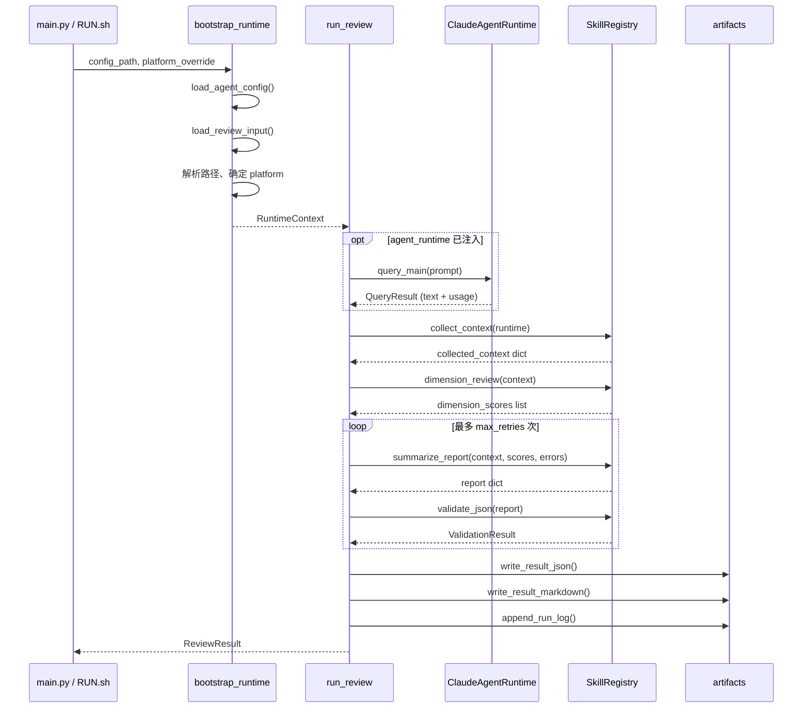

# CR-Agent（Claude Agent SDK 重构版）

CR-Agent 是一个基于 Claude Agent SDK 的代码审查（Code Review）Agent。项目采用分层架构：**启动装配（bootstrap）→ 编排器（orchestrator）→ 技能链（skills）→ 运行时（runtime）→ 产物输出（artifacts）**。

当前仓库处于重构阶段：核心契约、启动链路和编排骨架已落地；部分模块（工具层、Agent 定义、utils）仍为占位实现。

---

## 目录结构概览

```text
cr-agent/
├── RUN.sh                          # Shell 启动入口
├── INSTALL.sh                      # 环境安装脚本
├── requirements.txt
├── config/                         # 静态策略配置（维度、工具授权等模板）
├── docs/                           # 契约说明与升级文档
├── cr_agent/
│   ├── main.py                     # Python CLI 入口（当前 M0：仅 bootstrap）
│   ├── bootstrap.py                # 启动装配，构建 RuntimeContext
│   ├── agents/definitions.py       # Agent 定义占位（M2+）
│   ├── core/                       # 核心契约、编排、运行时
│   ├── skills/                     # 审查技能链
│   ├── tools/                      # 工具外观层（占位）
│   ├── utils/                      # 工具函数占位
│   └── schemas/                    # JSON 契约样例
├── prompt/                         # 各维度审查 Prompt 模板
└── workspace/<task>/               # 单次任务工作区
    ├── agent_config.toml
    ├── context.json
    └── cr_result/                  # 审查输出目录
```

---

## 数据结构一览

### 类型别名

| 名称 | 定义位置 | 说明 |
|------|----------|------|
| `Platform` | `core/agent_config.py` | `Literal["gitlab", "infcode"]`，运行平台标识 |
| `Severity` | `core/review_output.py` | `"critical" \| "major" \| "minor" \| "info"`，问题严重级别 |
| `RunStatus` | `core/review_output.py` | `"success" \| "failed" \| "error" \| "bootstrap_ready"`，运行状态 |

### Pydantic 模型（外部契约）

| 模型 | 定义位置 | 用途 |
|------|----------|------|
| `ContextConfig` | `core/agent_config.py` | `agent_config.toml` 中的 `[context]` 段 |
| `ProjectConfig` | `core/agent_config.py` | `[project]` 段，项目元信息 |
| `LlmConfig` | `core/agent_config.py` | `[llm]` 段，模型与 API 配置 |
| `AgentConfig` | `core/agent_config.py` | 完整 TOML 配置根模型 |
| `ReviewInput` | `core/review_input.py` | `context.json` 输入契约 |
| `TokenUsage`（输出） | `core/review_output.py` | 输出 result.json 中的 token 消耗 |
| `LineComment` | `core/review_output.py` | GitLab 风格行级评论 |
| `LineComments` | `core/review_output.py` | 行级评论列表容器 |
| `IssueLocation` | `core/review_output.py` | 问题代码位置 |
| `IssueSummary` | `core/review_output.py` | 结构化问题摘要 |
| `ReviewResult` | `core/review_output.py` | 最终 `result.json` 输出契约 |

### dataclass / Protocol

| 名称 | 定义位置 | 用途 |
|------|----------|------|
| `RuntimeContext` | `bootstrap.py` | 启动后传递给编排器的运行时上下文 |
| `TokenUsage`（内部） | `core/types.py` | 运行时内部 token 累计 |
| `QueryResult` | `core/types.py` | 单次 LLM 调用结果 |
| `ValidationResult` | `core/types.py` | JSON 校验结果 |
| `ReviewState` | `core/state.py` | 编排过程中的可变状态 |
| `SkillRegistry` | `skills/registry.py` | 技能函数集合 |
| `ToolSpec` | `tools/provider.py` | 工具规格描述 |
| `ToolFacade` | `tools/facade.py` | 工具外观层 |
| `AgentRuntime` | `core/orchestrator.py` | 运行时 Protocol 接口 |

### 异常类

| 异常 | 定义位置 | 说明 |
|------|----------|------|
| `RuntimeCallError` | `core/errors.py` | 模型运行时调用失败（基类） |
| `RuntimeTimeoutError` | `core/errors.py` | 调用超时 |
| `RuntimeTokenLimitError` | `core/errors.py` | Token 上限 |
| `RuntimeContextLimitError` | `core/errors.py` | 上下文窗口上限 |

---

## 各模块函数说明

### `cr_agent/main.py` — CLI 入口

| 函数 | 输入 | 输出 | 功能 |
|------|------|------|------|
| `_build_parser()` | 无 | `argparse.ArgumentParser` | 构建 CLI 参数解析器（`--config`、`--platform`） |
| `main()` | 命令行参数 | `int`（退出码） | 调用 `bootstrap_runtime` 装配上下文，写入 M0 占位结果到 `result.json` / `cr_result.md` |

> 注意：当前 `main()` 尚未接入 `run_review` 编排器，仅完成 bootstrap 并输出占位产物。

---

### `cr_agent/bootstrap.py` — 启动装配

#### 数据结构：`RuntimeContext`

| 字段 | 类型 | 说明 |
|------|------|------|
| `config_path` | `Path` | agent 配置文件路径 |
| `config` | `AgentConfig` | 解析后的配置对象 |
| `context_path` | `Path` | context.json 路径 |
| `workspace_dir` | `Path` | 任务工作区目录 |
| `result_dir` | `Path` | 审查结果输出目录 |
| `platform` | `Platform` | 最终确定的平台 |
| `review_input` | `ReviewInput` | 解析后的审查输入 |

| 函数 | 输入 | 输出 | 功能 |
|------|------|------|------|
| `bootstrap_runtime(config_path, platform_override)` | 配置路径；可选平台覆盖 | `RuntimeContext` | 加载 TOML 与 context.json，解析路径，确定平台，设置环境变量，返回运行时上下文 |
| `_require_platform(value, source)` | 平台字符串；来源标识 | `Platform \| None` | 校验平台值是否合法 |
| `_resolve_path(base_dir, raw_path)` | 基准目录；相对/绝对路径 | `Path` | 解析配置文件中的路径（优先 config 目录，其次 cwd） |
| `_record_bootstrap_issue(...)` | 结果目录、路径、错误原因 | `None` | 启动失败时写入 `run.log` 便于排查 |

**平台识别优先级**：`--platform` 命令行参数 > `agent_config.toml` 根级 `[platform]` > `[llm].platform`

---

### `cr_agent/core/agent_config.py` — 运行配置契约

#### 数据结构

- **`ContextConfig`**：`json_path`（必填）、`result_path`（可选，默认推导）
- **`ProjectConfig`**：`language`、`status`、`guidelines_path`、`requirements_path`
- **`LlmConfig`**：`model`（必填）、`api_key`、`api_base`、`platform`
- **`AgentConfig`**：根模型，包含 `context`、`project`、`llm`、`platform`

| 函数 | 输入 | 输出 | 功能 |
|------|------|------|------|
| `AgentConfig.configured_platform()` | `self` | `Platform \| None` | 返回根级 platform 或 `[llm].platform` 的兼容回退 |
| `load_agent_config(config_path)` | TOML 文件路径 | `AgentConfig` | 读取并校验 agent 配置 |

---

### `cr_agent/core/review_input.py` — 审查输入契约

#### 数据结构：`ReviewInput`

核心必填字段：`task_id`、`title`、`diff_content`、`project_root`

可选/兼容字段：`commit_messages`、`project_id`、`mr_iid`、`description`、SHA 系列、分支名、`requirements_doc`（兼容 `requirements_Doc`）、`previous_report`、`platform` 等。

| 函数 | 输入 | 输出 | 功能 |
|------|------|------|------|
| `load_review_input(context_path)` | context.json 路径 | `ReviewInput` | 读取 JSON 并校验 |
| `_normalize_commit_messages(raw_value)` | 任意原始值 | `list[str]` | 将字符串或列表统一为 commit message 列表 |
| `ReviewInput.normalize_requirement_aliases` | 原始 dict | dict | 处理 `requirements_Doc` 与 `requirements_doc` 别名冲突 |

---

### `cr_agent/core/review_output.py` — 审查输出契约

#### 数据结构

- **`ReviewResult`**：最终输出，含 `llm_result`（Markdown 报告）、`status`、`log_path`、`tokens_consume`、`line_comments`、`issues`
- **`LineComment`**：`new_path`、`body`、`start_line`、`end_line`（行号范围校验）
- **`IssueSummary`**：`severity`、`title`、`count`、`locations`

| 函数 | 输入 | 输出 | 功能 |
|------|------|------|------|
| `load_review_result(result_path)` | result.json 路径 | `ReviewResult` | 读取并校验输出契约 |
| `write_review_result(result_path, result)` | 路径；ReviewResult | `None` | 序列化写入 result.json |

---

### `cr_agent/core/types.py` — 运行时内部类型

| 数据结构 | 字段 | 说明 |
|----------|------|------|
| `TokenUsage` | `input_tokens`, `output_tokens`, `cache_creation_tokens`, `cache_read_tokens` | 内部 token 计数 |
| `QueryResult` | `text`, `usage`, `raw`, `error` | 单次 LLM 查询结果 |
| `ValidationResult` | `valid`, `errors` | 报告 JSON 校验结果 |

---

### `cr_agent/core/state.py` — 编排状态

#### 数据结构：`ReviewState`

| 字段 | 类型 | 默认值 | 说明 |
|------|------|--------|------|
| `status` | `str` | `"running"` | 当前状态 |
| `attempt` | `int` | `0` | 当前重试次数 |
| `max_retries` | `int` | `2` | 最大重试次数 |
| `tokens_consume` | `TokenUsage` | 空 | 累计 token 消耗 |
| `errors` | `list[str]` | `[]` | 错误列表 |
| `warnings` | `list[str]` | `[]` | 警告列表 |

---

### `cr_agent/core/usage.py` — Token 用量工具

| 函数 | 输入 | 输出 | 功能 |
|------|------|------|------|
| `accumulate_usage(total, call)` | 两个 `TokenUsage` | `TokenUsage` | 累加 token 计数 |
| `extract_usage(raw_response)` | SDK 原始响应（dict 或对象） | `TokenUsage` | 从响应中提取 usage 字段 |
| `_usage_payload(raw_response)` | 原始响应 | usage 子对象或 `None` | 内部：定位 usage 载荷 |
| `_int_field(payload, *names)` | 载荷；字段名列表 | `int` | 内部：按多个候选字段名读取整数值 |

---

### `cr_agent/core/errors.py` — 运行时异常

定义四个异常类（见上文「异常类」表格），均继承自 `RuntimeCallError`。

---

### `cr_agent/core/artifacts.py` — 产物写入

| 函数 | 输入 | 输出 | 功能 |
|------|------|------|------|
| `write_result_json(result_dir, result)` | 结果目录；`ReviewResult` | `Path` | 写入 `result.json` |
| `write_result_markdown(result_dir, content)` | 结果目录；Markdown 字符串 | `Path` | 写入 `cr_result.md` |
| `append_run_log(result_dir, message)` | 结果目录；日志消息 | `Path` | 追加写入 `run.log`（带时间戳） |

---

### `cr_agent/core/sdk_runtime.py` — Claude Agent SDK 适配层

#### 类：`ClaudeAgentRuntime`

| 方法 | 输入 | 输出 | 功能 |
|------|------|------|------|
| `__init__(config, client=None)` | 配置；可选 SDK 客户端 | — | 构造运行时，测试时可注入 fake client |
| `query_main(prompt, *, assembled_options, timeout_s=300)` | prompt 字符串 | `QueryResult` | 调用 main agent |
| `query_subagent(agent_name, prompt, *, assembled_options, timeout_s=300)` | agent 名；prompt | `QueryResult` | 调用指定 subagent |
| `_query(...)` | 内部参数 | `QueryResult` | 统一查询逻辑：超时控制、错误分类、文本提取 |
| `_invoke_client(...)` | 内部参数 | 原始 SDK 响应 | 调用 client.query() |

| 模块函数 | 输入 | 输出 | 功能 |
|----------|------|------|------|
| `_extract_text(raw_response)` | SDK 原始响应 | `str` | 从 dict/对象中提取 text/content/result |
| `_classify_runtime_error(exc, agent_name)` | 异常；agent 名 | `RuntimeCallError` 子类 | 按错误消息分类 token/context 限制 |

---

### `cr_agent/core/orchestrator.py` — 审查编排器

| 函数 | 输入 | 输出 | 功能 |
|------|------|------|------|
| `run_review(runtime_context, *, agent_runtime, skill_registry, max_retries=2)` | `RuntimeContext`；可选运行时与技能注册表 | `ReviewResult` | **核心编排流程**：collect → dimension review → summarize → validate（带重试）→ 写产物 |
| `_build_review_result(...)` | 上下文、状态、报告 dict | `ReviewResult` | 将内部状态与报告组装为最终输出契约 |

**编排流程简述**：

1. 初始化 `ReviewState` 和技能注册表
2. （可选）调用 `agent_runtime.query_main` 做规划，累计 token
3. `registry.collect_context` 收集审查上下文
4. `registry.dimension_review` 多维度审查
5. 循环：`summarize_report` → `validate_json`，失败则重试（最多 `max_retries` 次）
6. 写入 `result.json`、`cr_result.md`、`run.log`

---

### `cr_agent/core/verify_contracts.py` — 契约校验 CLI

| 函数 | 输入 | 输出 | 功能 |
|------|------|------|------|
| `main()` | `--config`、`--context`、`--result` 三个路径 | `int`（0/1） | 分别加载 agent_config、context、result 并打印校验结果 |
| `_load_contract(label, path, loader)` | 标签；路径；加载函数 | 契约对象 | 包装加载错误为可读消息 |

---

### `cr_agent/skills/registry.py` — 技能注册表

| 函数/类型 | 输入 | 输出 | 功能 |
|-----------|------|------|------|
| `SkillRegistry` | 四个技能函数 | — | 不可变 dataclass，持有技能链 |
| `build_default_skill_registry()` | 无 | `SkillRegistry` | 注册默认占位技能 |
| `registered_skill_names()` | 无 | `set[str]` | 返回已注册技能名集合 |

---

### `cr_agent/skills/collect_context/skill.py`

| 函数 | 输入 | 输出 | 功能 |
|------|------|------|------|
| `collect_context(runtime_context)` | `RuntimeContext` | `dict[str, Any]` | 从 ReviewInput 提取 task_id、title、diff_content、project_root、platform |

---

### `cr_agent/skills/dimension_review/skill.py`

| 函数 | 输入 | 输出 | 功能 |
|------|------|------|------|
| `dimension_review(collected_context)` | 上下文字典 | `list[dict[str, Any]]` | 多维度审查（当前为 placeholder，返回固定分数） |

---

### `cr_agent/skills/summarize/skill.py`

| 函数 | 输入 | 输出 | 功能 |
|------|------|------|------|
| `summarize_report(collected_context, dimension_scores, validation_errors)` | 上下文；维度分数；上次校验错误 | `dict[str, Any]` | 生成含 `llm_result` 的报告 dict（当前为占位 Markdown） |

---

### `cr_agent/skills/validate_json/skill.py`

| 函数 | 输入 | 输出 | 功能 |
|------|------|------|------|
| `validate_json(report)` | 报告 dict | `ValidationResult` | 校验 `llm_result` 非空 |

---

### `cr_agent/tools/` — 工具层（占位）

#### `tools/provider.py`

| 名称 | 说明 |
|------|------|
| `ToolSpec` | `name`、`description`、`input_schema`、`handler` |
| `ToolProvider` | Protocol：`list_tools()` → `list[ToolSpec]`；`name()` → `str` |

#### `tools/facade.py`

| 函数 | 输入 | 输出 | 功能 |
|------|------|------|------|
| `ToolFacade.all_tools()` | `self` | `list[ToolSpec]` | 委托 provider 列出全部工具 |
| `build_tool_facade(provider)` | `ToolProvider` | `ToolFacade` | 构造外观层 |

#### `tools/cr_native/registry.py`、`tools/infcode/adapter.py`

占位文件，分别对应 M1（cr-native 工具）和 M8（Infcode CLI 适配）。

---

### 占位模块（尚未实现）

| 文件 | 状态 |
|------|------|
| `agents/definitions.py` | M2+ Agent 定义占位 |
| `utils/logging.py` | 日志工具占位 |
| `utils/git_ops.py` | Git 操作占位 |
| `utils/diff.py` | Diff 处理占位 |

---

## 完整调用流程示例

以下示例展示如何串联**所有已实现模块**，完成一次完整的 Code Review 编排。该模式与 `tests/test_orchestrator_smoke.py` 一致。

### 1. 准备工作区文件

**`workspace/task-1/agent_config.toml`**

```toml
platform = "gitlab"

[context]
json_path = "context.json"
result_path = "cr_result"

[llm]
model = "claude-sonnet-4-20250514"
api_key = "your-api-key"
api_base = "https://api.anthropic.com"
```

**`workspace/task-1/context.json`**

```json
{
  "task_id": "task-1",
  "title": "fix: 修复登录空指针",
  "diff_content": "diff --git a/auth.py b/auth.py\n--- a/auth.py\n+++ b/auth.py\n@@ -1,3 +1,5 @@\n def login(u, p):\n+    if not u or not p:\n+        raise ValueError('empty')\n     return token",
  "project_root": "/workspace/project_code",
  "commit_messages": ["fix: 修复登录空指针"]
}
```

### 2. Python 代码：串联全部模块

```python
import asyncio
from pathlib import Path

from cr_agent.bootstrap import bootstrap_runtime
from cr_agent.core.orchestrator import run_review
from cr_agent.core.review_output import load_review_result
from cr_agent.core.sdk_runtime import ClaudeAgentRuntime
from cr_agent.skills.registry import build_default_skill_registry
from cr_agent.tools.facade import build_tool_facade
from cr_agent.tools.provider import ToolProvider, ToolSpec


# ── Step 1: Bootstrap ──────────────────────────────────────────
# 加载 agent_config.toml + context.json，确定 platform，构建 RuntimeContext
config_path = Path("workspace/task-1/agent_config.toml").resolve()
runtime = bootstrap_runtime(config_path, platform_override=None)
# runtime 包含: config, review_input, platform, result_dir, workspace_dir 等

# ── Step 2: 构建 Runtime（可选，接入真实 SDK 时） ───────────────
# 注入 Claude Agent SDK client；测试时可传 fake client
# agent_runtime = ClaudeAgentRuntime(config=runtime.config, client=sdk_client)

# ── Step 3: 构建 Skill Registry ────────────────────────────────
registry = build_default_skill_registry()
# 也可单独调用各 skill:
#   context  = await registry.collect_context(runtime)
#   scores   = await registry.dimension_review(context)
#   report   = await registry.summarize_report(context, scores, None)
#   valid    = await registry.validate_json(report)

# ── Step 4: 构建 Tool Facade（占位，M1+ 接入真实工具） ─────────
class EmptyToolProvider:
    def list_tools(self) -> list[ToolSpec]:
        return []
    def name(self) -> str:
        return "empty"

tool_facade = build_tool_facade(EmptyToolProvider())
tools = tool_facade.all_tools()  # 当前为空列表

# ── Step 5: 运行编排器 ─────────────────────────────────────────
async def main():
    result = await run_review(
        runtime,
        agent_runtime=None,          # 传入 ClaudeAgentRuntime 实例以启用 main agent 规划
        skill_registry=registry,
        max_retries=2,
    )
    return result

result = asyncio.run(main())

# ── Step 6: 读取产物 ───────────────────────────────────────────
# run_review 已自动写入:
#   runtime.result_dir/result.json
#   runtime.result_dir/cr_result.md
#   runtime.result_dir/run.log
persisted = load_review_result(runtime.result_dir / "result.json")
print(f"status={persisted.status}")
print(f"report=\n{persisted.llm_result}")
```

### 3. 流程时序图



### 4. 各步骤数据流转

| 步骤 | 模块 | 输入 | 输出 |
|------|------|------|------|
| ① Bootstrap | `bootstrap.py` | `agent_config.toml` + `context.json` | `RuntimeContext` |
| ② Main Agent（可选） | `sdk_runtime.py` | prompt | `QueryResult` |
| ③ 收集上下文 | `collect_context` skill | `RuntimeContext` | `{task_id, title, diff_content, ...}` |
| ④ 维度审查 | `dimension_review` skill | 上下文字典 | `[{dimension, score, findings, ...}]` |
| ⑤ 生成报告 | `summarize` skill | 上下文 + 维度分数 + 校验错误 | `{llm_result: "# CR-Agent\n..."}` |
| ⑥ 校验报告 | `validate_json` skill | 报告 dict | `ValidationResult(valid=True/False)` |
| ⑦ 写产物 | `artifacts.py` | `ReviewResult` | `result.json` / `cr_result.md` / `run.log` |

### 5. Shell 启动（当前 M0 路径）

```bash
# 安装环境
bash INSTALL.sh

# 启动（当前仅执行 bootstrap + 占位输出）
bash RUN.sh --config workspace/task-1/agent_config.toml --platform gitlab
```

### 6. 契约校验

```bash
python -m cr_agent.core.verify_contracts \
  --config workspace/task-1/agent_config.toml \
  --context workspace/task-1/context.json \
  --result workspace/task-1/cr_result/result.json
```

---

## 平台识别规则

仅支持 `gitlab` 和 `infcode`，优先级：

1. `RUN.sh --platform <value>` 或 `main.py --platform <value>`
2. `agent_config.toml` 根级 `platform`
3. `[llm].platform`（兼容旧配置）

三者均缺失时启动失败。

---

## 相关文档

- 输入字段规范：[`docs/context_schema.md`](docs/context_schema.md)
- 契约样例：[`cr_agent/schemas/`](cr_agent/schemas/)
- 升级进度：[`docs/upgrade/implemented-progress.md`](docs/upgrade/implemented-progress.md)
