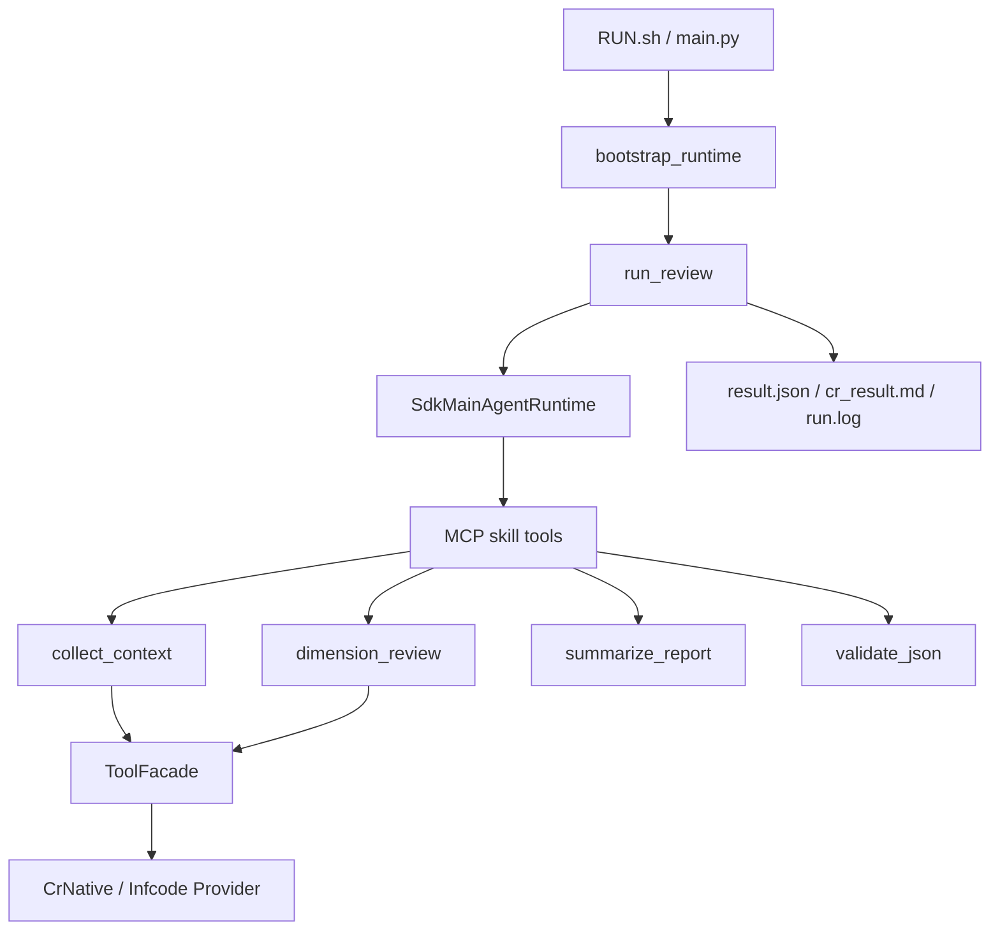

# CR-Agent

基于 Claude Agent SDK 的 MR/PR 自动化 AI 代码审查引擎。读取任务输入（`context.json`），经主 Agent 编排四阶段 Skill 流水线，产出结构化报告供后端消费。

> AI 编程 Agent（Claude Code 等）请阅读 [`CLAUDE.md`](CLAUDE.md)。

## 架构概览



**设计要点**：控制流反转——主 Agent 通过 MCP skill 工具决定阶段顺序与重试；`orchestrator` 负责兜底、usage 汇总与产物写盘。

| 层级 | 路径 | 职责 |
|------|------|------|
| 入口 | `RUN.sh`, `cr_agent/main.py` | Shell/CLI 启动 |
| Bootstrap | `cr_agent/bootstrap.py` | 加载配置，构建 `RuntimeContext` |
| 编排 | `cr_agent/core/orchestrator.py` | 驱动主 Agent，写最终产物 |
| 主 Agent | `cr_agent/core/main_agent.py` | 规划审查阶段 |
| Skills | `cr_agent/skills/` | 收集上下文、维度评分、汇总、校验 |
| Tools | `cr_agent/tools/` | 平台无关契约 + Provider 实现 |

## 审查维度与评分

`dimension_review` 按 `config/dimensions.toml` 的 platform profile 并发跑多个维度专家（gitlab profile 共 **10 个**）：

`business` · `security` · `performance` · `dependency` · `testing` · `error_handling` · `consistency` · `readability` · `maintainability` · `documentation`

- 每个维度有一对 prompt：`prompt/<dim>.md`（审查话术）+ `prompt/rules/<dim>Rule.md`（0-100 直接打分规则）。
- 维度产出的 finding 先经 `core/finding_filter.py` 按维度阈值过滤（business/security≥60，多数维度≥70，consistency/readability/documentation≥80；与 `summaryRule.md` 的「丢弃」阈值一致）。
- `summarize_report` 依 `prompt/rules/summaryRule.md` 的分组阈值把存活 finding 评定为 Critical/Major/Minor，去重聚合后产出报告与按行评论。
- 改审查话术只动 `prompt/`，改严重度计算只动 `prompt/rules/` 与 `finding_filter.py`，不动 skill 控制流。


## 快速开始

### 1. 安装

```bash
bash INSTALL.sh
```

创建 conda 环境 `cragent`（Python 3.11），安装 `requirements.txt` 依赖，并检查 git / ripgrep / ast-grep / Semble 等外部工具。

### 2. 运行完整审查

```bash
bash RUN.sh --config workspace/<task>/agent_config.toml --platform gitlab
```

等价于 `conda run -n cragent python -m cr_agent.main --config ... --platform gitlab`。默认跑完整 agentic 审查流水线。

产物写入 `result_dir`（由 `agent_config.toml` 的 `[context].result_path` 指定）：

```text
result_dir/
├── collected_context.json
├── dimensions/
│   ├── business.json
│   ├── security.json
│   └── manifest.json
├── summary_report.json
├── result.json
├── cr_result.md
└── run.log
```

## 运行模式

### 生产入口（`RUN.sh` / `main.py`）

完整审查：bootstrap → 主 Agent 驱动四阶段 Skill → 写盘产物。

```bash
bash RUN.sh --config workspace/<task>/agent_config.toml --platform gitlab [--timeout-s 300]
```

### Bootstrap 装配验证（`--bootstrap-only`）

只验证配置与输入加载，写出 `status="bootstrap_ready"` 占位产物，不调用 LLM：

```bash
bash RUN.sh --config <agent_config.toml> --platform gitlab --bootstrap-only
```

### Agentic 冒烟（`cr_agent.smoke`）

手动验证经 LiteLLM 网关的完整主 Agent 流程。前置条件：

1. 已安装 `claude` CLI
2. 运行中的 LiteLLM Anthropic-compatible Gateway
3. `agent_config.toml` 的 `[llm]` 已配置 `model` / `api_key` / `api_base`

```bash
conda run -n cragent python -m cr_agent.smoke --config <abs_path>/agent_config.toml --platform gitlab
```

### 工具层冒烟（`cr_agent.tools_smoke`）

端到端验收 cr-native 工具（`read_file` / `glob_files` / `grep_text` 等）。前置同 smoke，另需 `context.json` 的 `project_root` 指向真实仓库且系统已安装 `rg`。

```bash
conda run -n cragent python -m cr_agent.tools_smoke --config <abs_path>/agent_config.toml --platform gitlab
```

## 配置说明

### 运行时配置（每次任务）

位于 `workspace/<task>/`：

- `agent_config.toml` — LLM、context 路径、result 路径、git 设置
- `context.json` — diff、project_root、task_id 等审查输入

### 静态策略模板（`config/`）

- `dimensions.toml` — 平台维度列表与并发数
- `agent_tools.toml` — 各 agent 工具 allowlist
- `config.toml` — 项目模板样例
- `router.config.json` — 路由配置（不进主架构）

### Platform 识别

优先级：`--platform` > `agent_config.toml` 根级 `[platform]` > `[llm].platform`。仅支持 `gitlab` 和 `infcode`，缺失则启动失败。

### 本机路径注意

任务目录的 `agent_config.toml` 可能使用容器路径（如 `/workspace/...`）。本机运行建议复制到临时文件并替换为绝对路径，不要直接改原任务文件。

## 测试

开发模式：**定义接口 → 搭建测试骨架 → Smoke 通过 → 开发功能 → 补充测试 → 持续回归**。

约束：测试不访问真实外部服务、不调用真实 LLM、不启动 LiteLLM、不调真实 Claude SDK、不调真实工具。runtime / 主 agent / skill 均通过 `tests/fakes.py` 或 `unittest.mock.AsyncMock` 模拟。

```bash
# 全量
conda run -n cragent python -m pytest -q

# 单文件
conda run -n cragent python -m pytest -q tests/test_collect_context.py
```

当前约 **154** 项测试，覆盖 bootstrap、orchestrator、skills、tools、artifacts、contracts 等。

契约校验（三件套）：

```bash
conda run -n cragent python -m cr_agent.core.verify_contracts \
  --config <agent_config.toml> --context <context.json> --result <result.json>
```

## 目录结构

```text
cr-agent/
├── CLAUDE.md              # AI Agent 工作说明
├── INSTALL.sh
├── RUN.sh
├── requirements.txt
├── config/
│   ├── agent_tools.toml
│   ├── config.toml
│   ├── dimensions.toml
│   └── router.config.json
├── prompt/                # 维度审查与汇总 prompt
│   ├── *.md
│   └── rules/
├── cr_agent/
│   ├── main.py            # CLI 入口
│   ├── bootstrap.py       # RuntimeContext 装配
│   ├── smoke.py           # Agentic 冒烟
│   ├── tools_smoke.py     # 工具层冒烟
│   ├── agents/
│   ├── core/              # 编排、主 Agent、契约、产物
│   ├── schemas/
│   ├── skills/
│   │   ├── collect_context/
│   │   ├── dimension_review/
│   │   ├── summarize/     # skill 名: summarize_report
│   │   ├── validate_json/
│   │   └── registry.py
│   ├── tools/
│   └── utils/
├── tests/
└── workspace/             # 任务输入与审查产物
    └── <task>/
        ├── agent_config.toml
        ├── context.json
        └── changes.diff
```

## Git 工具与分支不变量

| 工具 | 行为 |
|------|------|
| `git_status` | 只读 |
| `git_rev_parse` | 只读 |
| `git_fetch` | 受控，默认 `allow_network=false` 降级 |
| `git_checkout` | **默认拒绝**，不隐式切分支 |

git token 优先级：`context.json.git_token` > `agent_config.toml [git].token` > `""`。日志只记 hash，不打印明文。

工作区在审查开始前应已处于 `source_branch`；分支切换由上游或显式步骤完成，CR-Agent 不自动 checkout。

## 扩展指引

| 扩展类型 | 关键文件 |
|----------|----------|
| 新 Skill | `skills/<name>/skill.py` + `SKILL.md` → `skills/registry.py` → `core/main_agent.py` |
| 新 Tool | `tools/catalog.py` → provider handler → `config/agent_tools.toml` |
| 新 Agent | `bootstrap.py` 注入 runtime → `config/agent_tools.toml` → `prompt/` |

详细扩展步骤见架构分析报告或 [`CLAUDE.md`](CLAUDE.md)。
